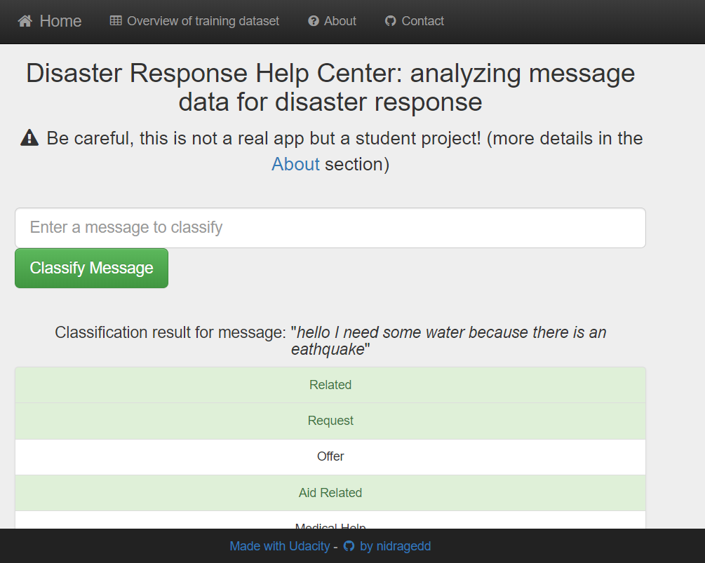
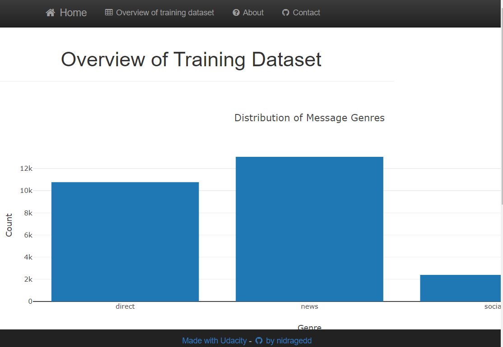

# Udacity DataScience nanodegree project - Disaster Response Pipeline Project
## Table of contents
* [1. Context - Objectives](#1-context---objectives)
* [2. About the data](#2-about-the-data)
* [3. Modeling](#3-modeling)
* [4. Webapp overview](#4-webapp-screenshots)
* [5. Configuration](#5-configuration)
* [6. Technical section](#6-technical-part)

---

## 1. CONTEXT - OBJECTIVES
### Context
This project is only for educational purposes. I did it while I was following the Udacity `DataScience nanodegree`.  
Machine learning is critical to helping different organizations understand which messages are relevant to them and which
messages to prioritize.  
During these disasters is when they have the least capacity to filter out messages that matter, and find basic methods 
such as using key word searches to provide trivial results.

### Objectives
In this project our goal is to analyze thousands of real messages provided by [Figure 8](https://www.figure-eight.com/),
sent during natural disasters either via social media or directly to disaster response organizations.  
We have several steps to follow:  
1.**Build an ETL pipeline** that processes message and category data from csv files and load them into a SQLite database  
2. **Build a Machine Learning pipeline** that will then read from SQLite DB to create and save a multi-output supervised 
learning model (yes, this is multi-class classification problem). Goal is to categorize these events so that we can send
the messages to an appropriate disaster relief agency.  
3. **Build a webapp** that will:
* be able to first launch both pipelines in order to populate everything that needs to be
* provide some data visualizations
* use our trained and saved model to classify new messages for 36 categories.

In the given use case, this webapp is used by an emergency worker: he gives a new message and gets classification results
in several categories.

---
## 2. ABOUT THE DATA
### Global overview
**TODO** + images

As you can see in this picture, some of the **classes are under-represented, data is then imbalanced**.

### Imbalanced data: drawbacks
_"Data is imbalanced"_ means that some of the categories appears a lot whereas some others appears
much less often. **This is an issue in Machine Learning** because we have too few examples to learn well and if our model
often see the same value it will obviously 'learn' that and tend to predict this value.  
**That is why we have to wisely choose the performance metric!**.  

#### Which performance metric?
If we choose `accuracy` as the performance metric to check whether we classify well or not, a dummy classifier that always
predict the most frequent class will have a good score but in the end we will have built a very poor model.
  
When data are imbalanced we can use other metrics such as:
* ***Precision:*** among all the positive predictions made by the model, we count how many of them were actually positive
in the train/validation/test dataset. This is a ratio and the higher the better because it means that our model is very
precise. In other words, when the model says it is True, it is actually True (in this case there are few _"False
Positives"_).
* ***Recall:*** among all the real positive values in the train/validation/test dataset, how many of them did our model
classified as positive? This metric indicates how good is our model to "catch them all". Indeed, the model can be very
precise (when it says it is positive, it is correct) but could still miss a lot of positive samples. And this is not 
good neither. Recall is also a ratio and the higher the better (in this case there are few _"False Negatives"_).

Depending on the use case, we might want to focus on `Recall` rather than `Precision` or vice-versa.  
> For example in medical domain, when algorithm says the person has/does not have cancer, we want this information to be as
accurate as possible (you can easily imagine the impacts when this is wrong), this is the _Precision_.  
But we also want to avoid saying someone that he does not have cancer whereas he actually has one (this is the worst 
case scenario). So perhaps in this case we want to focus more on _Recall_ (ensure we catch all of them) even if it means
that it is less precise.

If we do not want to choose between _Precision_ or _Recall_ because both are kind of equally important we can choose to
use the ***F1-Score*** metric which is the harmonic mean of both:  
F1 score = 2x ((Precision x Recall)/(Precision + Recall))

**F1-Score will be the selected metric in our case.**

#### Macro, micro, weighted?
Choosing F1-Score is not enough when working on multiclass outputs because we would like to know how 'accurate' we are
over all categories. How can we evaluate that?  
As explained in this [towardsdatascience post](https://towardsdatascience.com/journey-to-the-center-of-multi-label-classification-384c40229bff)
we have to average our results made for all categories and for that there are 2 options:
* the micro-averaging way
* or the macro-averaging one.  

In this project, we use the micro way as _"it is a useful measure when your dataset varies in size"_ (and remember that our classes/targets are imbalanced).  
Another interesting source about the difference and what to choose is available [here](https://datascience.stackexchange.com/questions/15989/micro-average-vs-macro-average-performance-in-a-multiclass-classification-settin)
where it is written that _"In a multi-class classification setup, micro-average is preferable if you suspect there might be class imbalance (i.e you may have many more examples of one class than of other classes)"_.


##### Readings
Here are few interesting readings on towardsdatascience about performance metrics in classification:
* [Accuracy, Recall, Precision, F-Score & Specificity, which to optimize on?](https://towardsdatascience.com/accuracy-recall-precision-f-score-specificity-which-to-optimize-on-867d3f11124)
* [How data scientists can convince doctors that AI works](https://towardsdatascience.com/how-data-scientists-can-convince-doctors-that-ai-works-c27121432ccd)
* [Multi-class metrics made simple](https://towardsdatascience.com/multi-class-metrics-made-simple-part-ii-the-f1-score-ebe8b2c2ca1)
* [Journey to the center of multi-label classification](https://towardsdatascience.com/journey-to-the-center-of-multi-label-classification-384c40229bff)


#### Ensure that we have enough data to train on
When data are imbalanced there is also another issue: how to ensure that in our training dataset we will have enough
samples of each class to train on and then be able to learn and classify correctly?  
The split between train and test dataset cannot then be totally random. There is this *[scikit-multilearn package](http://scikit.ml/index.html)*
that can help to [stratify the data](http://scikit.ml/stratification.html).  
We can also use other techniques such as:
* ***oversampling***: here we duplicate the data for classes that appears less so that in the end there are more of them and
algorithm can learn. The drawback is that depending on the use case, as it is the same data that is duplicated, the 
learning can have a big bias.
* ***undersampling***: randomly remove some occurrences of classes that appears the most. This is also a good idea but it can
lead us to a lot of data loss depending on how huge is the gap between classes.
* we could mix both oversampling and undersampling

***Note:*** none of this technique has been applied to this project, this could be a further improvement.

This is algo a good reading about metrics and resampling: [Dealing with Imbalanced Data](https://towardsdatascience.com/methods-for-dealing-with-imbalanced-data-5b761be45a18)

---
## 3. MODELING
### Approach
We will build a **supervised** NLP model with multilabel **classification** (and not multiclass!).
What is the difference? Well, "in multi-class problems the classes are mutually exclusive, whereas for multi-label 
problems each label represents a different classification task" ([source](https://towardsdatascience.com/journey-to-the-center-of-multi-label-classification-384c40229bff)).

### Eligible models
As it is a supervised classification problem I will take the **Logistic Regression** algorithm as a baseline. If I have 
enough time to do it,this baseline will be compared to tree based algorithms which are known to handle pretty well 
imbalanced data (such as _RandomForest_ for example).

As per scikit-learn documentation, for Logistic Regression: _"In the multiclass case, the training algorithm uses the 
one-vs-rest (OvR) scheme". So the Logistic Regression classifier will be wrapped by a [OneVsRestClassifier](https://scikit-learn.org/stable/modules/generated/sklearn.multiclass.OneVsRestClassifier.html) which 
consists in "fitting one classifier per class. For each classifier, the class is fitted against all the other classes"._

### Feature Engineering
For the text transformation, there are easy tricks such as putting everything in lower case, remove digits and stop words, etc.
Then we have the [choice between _Stemming_ or _Lemmatization_](https://www.datacamp.com/community/tutorials/stemming-lemmatization-python):  
* "Stemming and Lemmatization helps us to achieve the root forms (sometimes called synonyms in search context) of inflected (derived) words."
* "Stemming is different to Lemmatization in the approach it uses to produce root forms of words and the word produced. Stemming a word or sentence may result in words that are not actual words. Stems are created by removing the suffixes or prefixes used with a word."
"Lemmatization, unlike Stemming, reduces the inflected words properly ensuring that the root word belongs to the language. In Lemmatization root word is called Lemma. A lemma is the canonical form, dictionary form, or citation form of a set of words."


***The main transformations that are applied to the text are: TF-IDF vectorization on a tokenized and lemmatized text.***

For more details, please refer to this [notebook](notebooks/2-ML_pipeline_preparation.ipynb) that offers a walk through this part of the process.

### F1-Score Results
| Model                                  | Precision avg micro | Recall avg micro | F1-Score avg micro |
|----------------------------------------|---------------------|------------------|--------------------|
| Logistic Regression 1st try            | 0.6726              | 0.5169           | 0.5845             |
| Logistic Regression with new features  | 0.6857              | 0.5206           | 0.5919             |
| Logistic Regression with TF-IDF tuning | 0.7359              | 0.5344           | 0.6191             |
| Random Forest 1st try                  | 0.7683              | 0.3281           | 0.4599             |
| Random Forest with new features        | 0.7656              | 0.3250           | 0.4563             |
| Random Forest with TF-IDF tuning       | 0.7640              | 0.3308           | 0.4616             |

***Observations:***
* Since the beginning the **Logistic Regression model gave better result than the Random Forest** (but keep in mind that
parameters for Random Forest were arbitrary chosen and, obviously, choice was very bad).
* The several tries to improve results were good with Logistic Regression because in the end **we are 3.5% better on F1-Score with the latest version**.
Note that this is mainly due to a significant improvement on _Precision_ while _Recall_ increased less.
* It is important to note that **Random Forest is our best model for the _Precision_ metric** so depending on business choice,
it could be wise to select and tune this model. As my choice was based on F1-Score I have decided to focus on Logistic Regression.
* The Random Forest has a lower score because its _Recall_ is very bad and that is why its F1-Score does not increase a lot. 


#### Further improvements
Here are the things that can be done to go further on this project and improve it:
* Stratify the data (in our case, each class was fortunately represented in both training and testing datasets)
* Further tuning on ***max_df*** and ***max_features*** parameters of the ***TF-IDF vectorization***
* Tune RandomForest parameters
* Add new features based on text extractions
* Undersampling/Oversampling to have a better management of classes with few samples

---
## 4. WEBAPP SCREENSHOTS

Classification results:  


Some visualizations about the data:  


---
## 5. CONFIGURATION
This project is based on 2 configuration JSON files:
* config.json
* logging.json

A default (and working) version of those files are provided under the `config` directory in project's root directory.  
The `logging.json` file is just an external configuration for logging module parameters(loggers, parsers, file handlers).  
The `config.json` file is an homemade file where all parameters are provided. Please refer to this [file](config/CONFIG.md)
for more details about it.


---
## 6. TECHNICAL PART
### Dependencies & Installation - Create your CONDA virtual environment
Easiest way is to create a virtual environment through **[conda](https://docs.conda.io/en/latest/)**
and the given `environment.yml` file by running this command in a terminal (if you have conda, obviously):
```
conda env create -f environment.yml
```

If you do not have/want to use conda for any reason, you can still setup your environment by running some `pip install`
commands. Please refer to the `environment.yml` file to see what are the dependencies you will need to install.  
Basically, this project requires **Python 3.7** in addition to common datascience packages (such as 
[numpy](https://www.numpy.org/), [pandas](https://pandas.pydata.org/), 
[sklearn](https://scikit-learn.org/stable/), [matplotlib](https://matplotlib.org/), 
[seaborn](https://seaborn.pydata.org/) and so on).

For modeling, this project is using scikit-learn [LogisticRegression](https://scikit-learn.org/stable/modules/generated/sklearn.linear_model.LogisticRegression.html)
and [RandomForest](https://scikit-learn.org/stable/modules/generated/sklearn.ensemble.RandomForestClassifier.html) that are configured and tuned over
[pipelines](https://scikit-learn.org/stable/modules/generated/sklearn.pipeline.Pipeline.html) (see also [this](https://scikit-learn.org/stable/modules/compose.html)).  

There are those additional packages in order to expose our work within a webapp:
* [Flask](https://palletsprojects.com/p/flask/): used as web application framework/engine to run the app over HTTP
* [plotly](https://plot.ly/): used to generate some pretty visualizations displayed in webapp
* [spacy](https://spacy.io/): used for NLP tasks

### Directory & code structure
Here is the structure of the project:
```
    project
      |__ assets    (contains images displayed in notebooks)
      |__ config    (configuration section, so far it contains JSON files used to configure logging or the program)
      |__ data      (raw data)
            |__ output  (data processed and/or database saved locally)
      |__ notebooks  (contains all notebooks)
      |__ src       (python modules and scripts)
            |__ config  (scripts called to actually configure the program)
            |__ models  (python scripts used to build, train and save a ML model)
            |__ preprocessing  (python scripts used to preprocess the raw data)
            |__ templates  (HTML templates to serve through Flask, this is the 'view' part)
            |__ webapp  (python files corresponding to the webapp: this is the 'controller' part)
```

### Run the app on your local computer
1. Run the following commands in the project's root directory to set up your database and model.

    - To run ETL pipeline that cleans data and stores in database
        `python src/preprocessing/process_data.py -c ./config/config.json -l ./config/logging-console.json`
    - To run ML pipeline that trains classifier and saves
        `python src/models/train_classifier.py -c ./config/config.json -l ./config/logging-console.json`

2. Run the following command in the project's root directory to run the web app.
    `python src/app.py -c ./config/config.json -l ./config/logging-console.json`

3. Go to http://0.0.0.0:3001/ or http://localhost:3001/ with your favorite browser

***PAY ATTENTION*** to both mandatory arguments `-c` and `-l` which corresponds respectively to paths (relative or absolute, as you want)
to both configuration files (the config.json one as explained earlier in this documentation and the logging configuration one)
